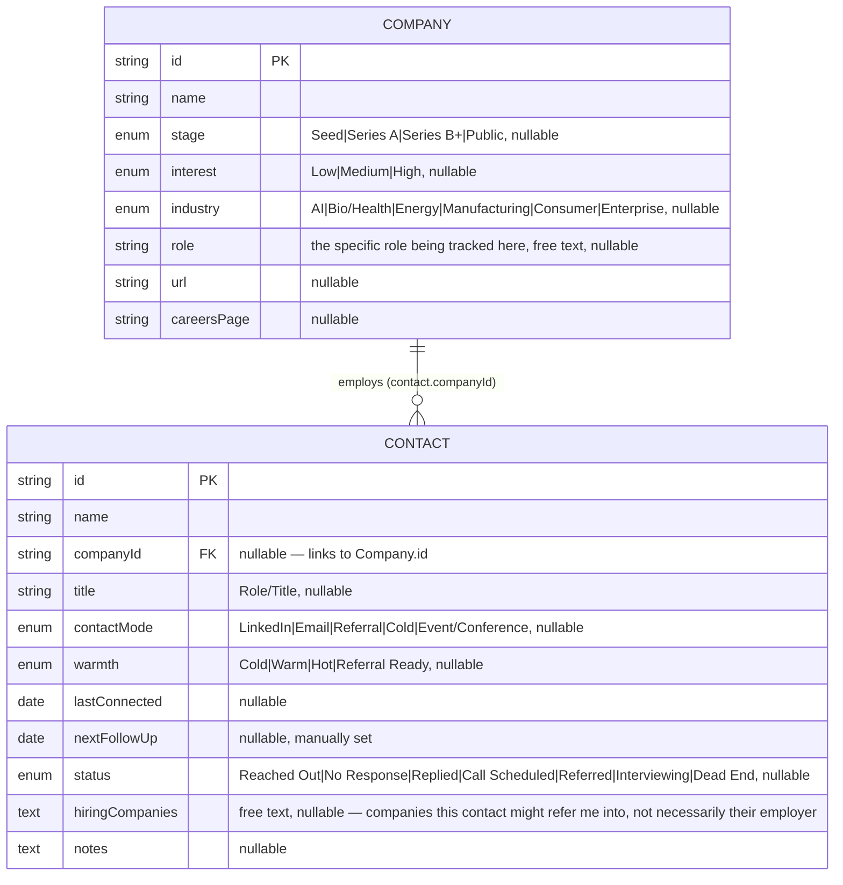

1;2A1;2A1;2A1;2B1;2B1;2B1;2A# Job Search Tracker

Status: draft
Owner: Raghav (single user)
Last updated: 2026-08-20

---

## What it is

A local, single-user tool for tracking job-search contacts and companies.
`tracker.html` — one static HTML file at the repo root, opened directly
in a browser. Two tabs, Contacts and Companies, each an editable table,
linked to each other. Data lives in the browser's `localStorage`. No
backend, no database, no build step.

---

## Data model

The shape of the JSON object stored under one `localStorage` key.

A contact optionally links to one company via `companyId`. A company's
Contact(s) list isn't stored — it's computed by filtering contacts for a
matching `companyId`. Deleting a company clears a linked contact's
`companyId`; it doesn't delete the contact.
