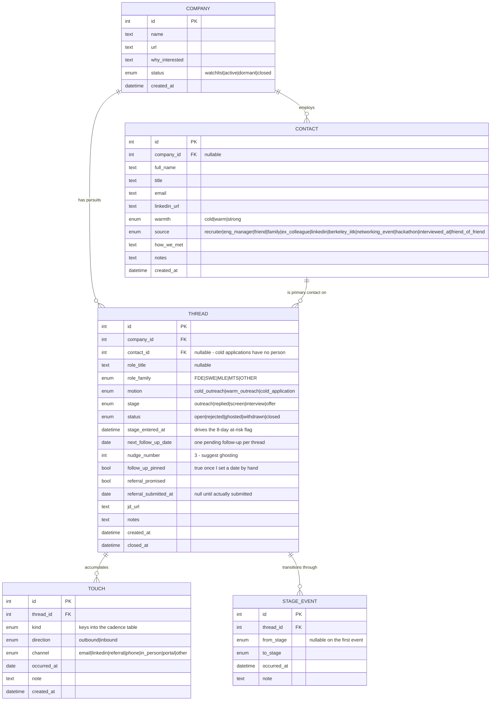
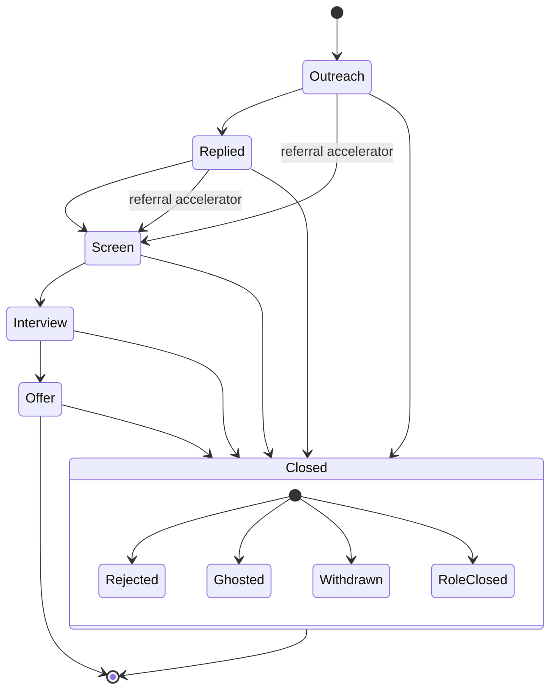

# Job Search Tracker — v1 Plan

Status: draft
Owner: Raghav (single user)
Last updated: 2026-08-18 (rev 4 — simplified for adoption after reviewing the first-draft sheets)

---

## 1. Overview

I am actively job searching for **Forward Deployed Engineer, Software Engineer, Machine Learning Engineer, and Member of Technical Staff** roles. The search has many moving pieces, and the failure mode is not lack of effort — it is losing the thread: forgetting who I owe a follow-up, letting a warm intro go cold, and having no honest read on whether this week's activity is producing conversations.

The search runs on two motions:

- **Bottom-up (warm).** I know a person — recruiter, friend, family, ex-colleague, network acquaintance — and reach out to explore opportunities at their company or tap their network.
- **Top-down (cold).** I identify a company of interest, find the open roles (if any), and reach out to founders / team members / hiring managers with a short blurb, then drive engagement toward a real conversation.

This tool is a **local, single-user web app** that does four things:

1. **Tracks every reach-out and its history**, so I always know who is owed a follow-up and when.
2. **Surfaces what's due today** — overdue nudges, follow-ups due, and threads at risk of going cold.
3. **Reports the funnel** — outreach → replies → screens → interviews → offers — against daily quotas and campaign targets.
4. **Holds a structured "About Me" corpus** — resume, experience, project deep-dives, standard answers — so agents can draw on it to fill forms and answer screening questions, and so I can hand referrers what they need.

### 1.1 What the first-draft sheets taught us

`docs/reference/bottom-up.csv` and `docs/reference/top-down.csv` are the honest baseline, and they reshaped this plan:

- **The bottom-up sheet has 9 columns; only 5 of ~30 rows have any of them filled.** The rest are names alone. The top-down sheet is company name plus an occasional job URL — no status, no dates, no contacts.
- **Conclusion: structure I don't maintain is structure that doesn't exist.** The earlier draft of this plan modeled 11 tables and 53 requirements. That tool gets abandoned in week two. This revision cuts to **5 tables and ~15 must-have requirements**, chosen so that the app beats the spreadsheet at the three things the spreadsheet cannot do — reminders, history, and funnel math — while asking for no more data entry than the spreadsheet did.
- **The funnel is 5 stages, not 6.** The sheet's own targets block merges "Recruiter Calls/Initial Screen" into one line. Adopted.
- **Two target systems, both real.** The sheet tracks cumulative campaign totals with deadlines (60 warm outreach, 40 by 8/17). The stated quotas are per-day (10 cold outreach/day). These are not in conflict — see §6.5.
- **A channel taxonomy already exists** in the sheet's scratch column — recruiters, EMs, friends, family, LinkedIn, Berkeley/IITK, networking events, hackathons, companies I interviewed at, connections-of-friends. It becomes one `source` field.
- **Not everything deserves a table.** The agency/community list (Scalr, FYSK, Jack & Jill, Levels FYI) and the strategy notes ("healthy signals: funding rounds, job openings") are markdown files. Modeling them is how a simple tool becomes a complicated one.

### 1.2 Architecture at a glance (decided)

| Decision | Choice |
| --- | --- |
| Form factor | Local web app — localhost, single user, no auth |
| Backend | **FastAPI** (Python), SQLAlchemy + Alembic |
| Frontend | **React + Vite + TypeScript** |
| Database | **SQLite**, one file in the repo — no Docker, no container to start |
| Corpus | Markdown files in the repo, no database index |
| Config | One YAML file: cadences, quotas, targets, enums |
| Schema | **5 tables**; one primary contact per thread |
| Data entry (v1) | Manual quick-add + CSV import. **No LLM anywhere in v1** |
| Follow-up timing | Default cadence per touch kind, overridable per thread |
| Reminders | Daily digest I trigger — no push, no cron |
| Agent access | Read-only: agents read the SQLite file and markdown corpus from the repo |

### 1.3 Constraint worth restating

**LinkedIn has no usable API for messages or connection activity.** Auto-ingest is not legitimately available — scraping violates their terms and breaks constantly. The supported paths are their own data-export archive (`messages.csv`, `connections.csv`) or manual entry. v1 assumes manual entry.

---

## 2. Goals

**G1 — Nothing goes cold by accident.** Every open thread has a next-follow-up date. Anything overdue is visible in one place, every day.

**G2 — One screen answers "what do I do now?"** Overdue, due today, at risk, and today's numbers.

**G3 — An honest funnel.** Stage counts and conversion rates across both motions, so I can tell whether the problem is top-of-funnel volume, weak reply rates, or losing people at the screen.

**G4 — Activity against a target.** Daily quotas for the things I control, campaign totals for the things I don't (§6.5).

**G5 — Low enough friction that I actually use it.** Logging a touch takes under 15 seconds and no more fields than the spreadsheet asked for. **This goal outranks G3 and G4 whenever they conflict** — a richer model that goes unmaintained produces worse data than a thin one that gets used.

**G6 — An agent-ready corpus about me.** Structured markdown covering resume, experience, projects, and standard answers, good enough that an agent can fill a form without me re-typing my history.

**G7 — Durable, portable, inspectable data.** SQLite + markdown in a git repo. No lock-in, diffable, readable by Claude Code with no integration layer.

### Success criteria

- Zero follow-ups missed through oversight — every miss is a decision.
- I open the digest on ≥80% of working days and it's the first thing I look at.
- "How many live conversations do I have, and what's my cold reply rate?" — answerable in under 10 seconds.
- Two weeks after launch, the spreadsheet is dead and I haven't reopened it.

---

## 3. Non-goals (v1)

**N1 — No auto-applying to jobs.** Ever. Volume without judgment is a reputation risk and makes every application worse.

**N2 — No multi-user, auth, or hosting.** Single user, localhost.

**N3 — No mobile or responsive polish.** Desktop browser only.

**N4 — No Gmail or LinkedIn ingest.** v1.1.

**N5 — No resume generation or tailoring.** The corpus is populated and retrievable in v1; JD-in → tailored-resume-out is its own project.

**N6 — No LLM dependency of any kind in v1.** No paste-to-parse, no auto-classification, no API keys. v1 must run offline and behave deterministically. This is what makes it shippable.

**N7 — No many-to-many contacts per thread.** One primary contact per thread. Knowing three people at one company means three threads. Upgradeable later without data loss.

**N8 — No job-board scraping or role discovery.** Deferred, not abandoned — and when built it must cover a specific chosen set of sources, not LinkedIn alone.

**N9 — No CRM features.** No email sending, no templates, no sequences, no attachments, no calendar integration.

**N10 — No analytics beyond the funnel.** No cohorts, no forecasting.

---

## 4. Users and actors

| Actor | Type | Role |
| --- | --- | --- |
| **Me** | Human, sole user | Logs touches, advances stages, reviews the digest, maintains the corpus, sets targets. |
| **Web app** | System | Serves the UI, applies cadence rules, computes due dates, funnel metrics, target progress. |
| **Repo** | System | SQLite file + markdown corpus + config YAML. Source of truth; `git commit` is the backup. |
| **AI agent (Claude Code)** | System, read-only | Reads the SQLite file and corpus to draft follow-ups, answer application questions, prepare referral blurbs. No write path in v1. |

Contacts, companies, and recruiters are **data, not actors** — they never touch the system.

---

## 5. User stories

**v1 stories.** Deferred stories are listed in §6.9.

### Capture
- **US-1** — Log a reach-out in under 15 seconds, so logging never becomes the reason I skip logging.
- **US-2** — Record how I know a contact and where they came from (recruiter, friend, Berkeley/IITK, hackathon, cold LinkedIn), so a follow-up months later still has context.
- **US-3** — Add a target company with a note on why I'm interested, before any role exists.
- **US-4** — Attach a role and JD link to a company, so later tailoring has source material.
- **US-5** — Record that a referral was promised and whether it was actually submitted, so referral promises don't evaporate.
- **US-6** — Import my two existing sheets on day one, so the tool starts with real history instead of empty.

### Staying on top
- **US-7** — Have each touch set the next follow-up date automatically, so I never have to remember a cadence.
- **US-8** — Override a date when someone says "check back in March".
- **US-9** — See every overdue and due-today follow-up in one ranked list.
- **US-10** — See the full history of a thread on one page, so I can write a follow-up without reconstructing context from my inbox.
- **US-11** — Snooze a follow-up, so "not now" doesn't force me to act or let it rot.
- **US-12** — Be prompted to close a thread as ghosted after 3 unanswered nudges.

### Progress
- **US-13** — See today's counts against my daily quotas, so I know whether I've done enough today.
- **US-14** — See campaign progress — 60 warm outreach, 100 cold applications — against their deadlines.
- **US-15** — See the funnel with conversion rates, warm vs cold side by side, so I can shift effort toward whichever motion works.
- **US-16** — See how many live conversations I have right now.

### About Me corpus
- **US-17** — Store resume, experience, project deep-dives, story bank, and standard answers as structured markdown.
- **US-18** — Browse and search the corpus from the app and copy any section, while a form is open in the next tab.
- **US-19** — Have an agent read the corpus directly from the repo, so it can draft a referral blurb or fill a form with no pasting.

---

## 6. Functional requirements — v1

**15 must-haves.** Anything not listed here is deferred to §6.9. Requirements are grouped by the screen or job they serve, because that is how they will be built.

### 6.1 Data and platform

- **FR-1** — Five tables: `company`, `contact`, `thread`, `touch`, `stage_event` (§7). SQLite file in the repo. SQLAlchemy + Alembic, behind a repository layer so the database stays a swappable detail.
- **FR-2** — One `config.yaml` holds cadence intervals, daily quotas, campaign targets, role families, contact sources, and the staleness threshold. Changing a quota is a text edit, not a migration.
- **FR-3** — Runs with one command. FastAPI serves the API; Vite serves the React frontend. No container, no external service, no network dependency.

### 6.2 Capture

- **FR-4** — **Quick-add thread**: one form, and only `company` is required. Role, role family, contact, motion, and JD URL are optional and remembered as defaults. A thread may exist with no contact (cold application) and a contact may exist with no company.
- **FR-5** — **Log touch in one click** from the digest, the thread page, or the company page. Three fields: what kind of touch, a free-text note, and the date (defaulting to today). Everything else — next follow-up date, nudge number, stage suggestion — is derived.
- **FR-6** — **CSV import** for `docs/reference/*.csv` and any future export, with a preview-and-confirm step and a column mapper. Bad rows are reported, never silently dropped.

### 6.3 Follow-ups

- **FR-7** — Each thread carries a single `next_follow_up_date` and `nudge_number`. Logging an outbound touch sets the date from the **cadence table by touch kind** (all intervals in business days):

  | Touch kind | 1st nudge | 2nd nudge | 3rd nudge | Then |
  | --- | --- | --- | --- | --- |
  | Cold outreach | +5 | +10 | +20 | Suggest ghosting |
  | Warm intro request | +3 | +6 | +12 | Suggest ghosting |
  | Referral promised | +2 | +5 | +10 | Ask directly, then close |
  | Post-recruiter call / screen | +3 | +6 | +12 | Suggest ghosting |
  | Post-interview | +3 | +7 | +12 | Escalate, then close |
  | Application submitted (no contact) | +7 | +14 | — | Suggest ghosting |
  | Long-term nurture | +90 | recurring | — | — |

- **FR-8** — Any date I set manually wins over the cadence, permanently, for that thread.
- **FR-9** — Logging an **inbound** touch clears the pending follow-up, resets `nudge_number`, and prompts for the next action.
- **FR-10** — Snooze by a chosen interval. Weekends are skipped when computing dates.
- **FR-11** — After 3 unanswered nudges, the app **suggests** closing as ghosted. It never closes anything on its own.

### 6.4 Daily digest

- **FR-12** — One page, the app's home, containing: (a) overdue follow-ups ranked by days overdue then by stage; (b) due today; (c) **at risk** — threads in the same stage for more than 8 days; (d) today's quota progress; (e) live conversation count. Every row is actionable in place: log, snooze, advance, close.

### 6.5 Funnel and targets

- **FR-13** — **Stages (5):** `Outreach sent` → `Replied` → `Screen` (recruiter call or initial screen) → `Interview` → `Offer`. Terminal states from anywhere: `Rejected`, `Ghosted`, `Withdrawn`, `Closed`. Stages may be skipped forward and corrected backward. Transitions are recorded as `stage_event` rows.

  *Referral is deliberately not a stage.* It is not a step everyone passes through — it is an accelerator that jumps a thread to `Screen`. It is tracked as a flag and date on the thread, and as a daily quota.

- **FR-14** — Funnel view: counts per stage, stage-to-stage conversion, sliceable by **motion** (cold outreach / warm outreach / cold application) and **role family** (FDE / SWE / MLE / MTS), over today / 7d / 30d / all.

- **FR-15** — **Targets, in two layers**, reconciling the sheet's model with the stated quotas:

  **Daily quotas — inputs I control.** These drive the "did I do enough today" number.

  | Metric | Daily quota |
  | --- | --- |
  | Cold outreach sent | 10 |
  | Warm intro requests sent | 6 |
  | Cold applications submitted | 6 |
  | Referral asks made | 3 |

  **Campaign targets — cumulative, with a deadline.** These are the sheet's model, and they include outcomes.

  | Metric | Target | Type |
  | --- | --- | --- |
  | New connections made | 60 | Input |
  | Warm outreach with acquaintances | 60 | Input |
  | Cold applications | 100 | Input |
  | Screens / recruiter calls | 60 | **Outcome** |
  | Interviews | 25 | **Outcome** |
  | Offers | 3 | **Outcome** |

  Only **inputs** carry a daily quota. Outcomes are tracked and charted against the campaign target but never appear as a daily number I can fail — a target I can miss while doing everything right stops functioning as a target and becomes noise I learn to ignore. Outcome targets serve as a forecast: at the current conversion rate, the dashboard shows whether 60 screens implies enough outreach to get there.

  Cold applications appear in both layers, and that is intentional: 6/day is the pace, 100 is the finish line.

### 6.6 About Me corpus

- **FR-16** — Markdown corpus in the repo, one concern per file, with YAML frontmatter (`title`, `tags`, `updated`):
  - `resume/` — current resume(s), markdown plus source/PDF
  - `experience/` — one file per role held: scope, impact, metrics
  - `projects/` — one file per project: problem, approach, stack, outcome
  - `answers/` — standard application answers, one per question
  - `stories/` — STAR-format behavioral stories
  - `facts/` — visa status, notice period, comp expectations, locations, links
  - `strategy/` — narrative work and search notes (the Mariana story, healthy-signal criteria, agencies and communities list)
- **FR-17** — Browse and search the corpus in the app, with one-click copy of any section. Search is filesystem-backed; no index table.

### 6.7 Agent access

- **FR-18** — Agents read the SQLite file and markdown corpus directly from the repo. Read-only in v1; no write path.
- **FR-19** — A checked-in `SCHEMA.md` plus a `queries/` directory of saved SQL (due follow-ups, live pipeline, funnel this week, at-risk threads) so an agent has a working entry point without introspecting the database.

> That is 19 numbered requirements, of which FR-16/17 and FR-19 are corpus and agent plumbing rather than app screens — roughly 15 items of actual application to build.

### 6.8 Explicitly not built in v1

Deferred with a reason, so the boundary holds when it gets tempting:

| Deferred | Why | Target |
| --- | --- | --- |
| Paste-to-parse extraction | Adds an LLM dependency and non-determinism to the one path that must never fail | v1.1 |
| Gmail reply detection | Biggest single build item; needs the model settled first | v1.1 |
| LinkedIn export import | Depends on export cadence; low volume | v1.1 |
| Many-to-many contacts per thread | Real but rare; costs a join table and two more forms | v1.2 |
| Corpus index table + linking corpus items to threads | Nothing depends on it until tailoring exists | v1.2 |
| Answer-fill assistant, resume tailoring | Their own project | v2 |
| Job-board scraping | Needs a source list first | v2 |
| MCP server with write tools | Read-only is enough to be useful | v2 |
| Postgres, hosting, auth | Only if this leaves localhost | If ever |
| Duplicate detection, weekly rollups, time-in-stage medians, CSV export | Nice, not load-bearing | As needed |

---

## 7. Data model

Five tables. Every column below earns its place by appearing in a v1 requirement.

### 7.1 Entity relationships

### 7.2 Pipeline states

### 7.3 Design notes

**`thread` is the unit of pursuit, and it is deliberately shallow.** It absorbs what rev 3 split across `opportunity` and `opportunity_contact`. One thread ≈ one row of the bottom-up sheet. If three people at one company are worth pursuing, that is three threads sharing a company — slightly redundant, and far more likely to be maintained than a join table with a role enum.

**`next_follow_up_date` lives on `thread`, not on `touch`.** One pending follow-up per thread is the whole model. The digest becomes `SELECT * FROM thread WHERE next_follow_up_date <= today AND status = 'open'` — a query I can read, an agent can run, and an index can serve.

**`follow_up_pinned` is how FR-8 is enforced.** Once I set a date by hand, the cadence stops overwriting it. Without this flag, "check back in March" silently becomes "+5 business days" on the next touch, and the tool has quietly lied to me.

**`contact_id` and `role_title` are nullable, and both matter.** The top-down sheet is company + URL with no person and often no role. The bottom-up sheet is a person with, frequently, no company. A schema that requires either would have rejected most of the real data on import — the clearest possible sign it was wrong.

**Stage history is events, not a column.** Conversion rates and time-in-stage are unanswerable from a mutable field. `stage_entered_at` is denormalized onto `thread` only so the at-risk query stays a plain comparison.

**Cadences, quotas, and targets are config, not tables.** They will be tuned once real reply-rate data exists; a YAML edit beats a migration. They move into the database the day I want history of what the targets used to be — not before.

**Deliberately absent:** no `daily_stats` table (every number derives from `touch` and `stage_event`; a counter table is the fastest way to get two sources of truth that disagree), no `corpus_item` table (the markdown files are the truth), no `cadence_rule` table, no `target` table, no join tables at all.

---

## 8. Adoption plan

The plan's biggest risk is not technical. It is that this ends up as a second spreadsheet I stop updating. Countermeasures, in build order:

1. **Import first, build second.** Day one, the CSV importer runs against `docs/reference/*.csv`. The app is never empty, and the first thing I see is my real network.
2. **Hard cutover, no parallel period.** The sheet goes read-only the day import lands. Maintaining both means maintaining neither.
3. **The digest is the home page.** Not a dashboard I navigate to — the thing that loads when I open the app.
4. **One-click log from every surface.** If logging a touch ever requires navigating to a thread first, that is a bug against G5.
5. **Optional fields stay optional.** No required field beyond company name. The sheet proves that anything else will be left blank, and a form that blocks on blank fields is a form I stop opening.
6. **Bulk mode for outreach days.** Ten cold outreaches should be ten rows in one screen, not ten form submissions.
7. **Two-week review.** After two weeks of real use, check which fields are still empty and delete them. Fields that go unfilled are not features awaiting discipline — they are design errors.

---

## 9. Decisions and open questions

### Resolved

| Question | Decision |
| --- | --- |
| Form factor | Local web app, localhost, single user |
| Backend / frontend | FastAPI + React/Vite/TypeScript |
| Database | **SQLite** — no Docker; Postgres only if this ever leaves localhost |
| Schema depth | **5 tables**, one primary contact per thread |
| Entry method | Manual quick-add + CSV import; **no LLM in v1** |
| Stages | 5 — recruiter call and initial screen merged, per the sheet |
| Cadence | Per touch kind, tightened for warm/referral/post-call (FR-7) |
| Ghost threshold | 3 unanswered nudges → suggest closing |
| At-risk threshold | 8 days in the same stage |
| Targets | Daily quotas for inputs + campaign totals for outcomes (FR-15) |
| Gmail / LinkedIn ingest | v1.1 |
| Job-board discovery | v2, and must cover a chosen source list |
| Agent access | Read-only file reads + saved queries |

### Open

1. **The campaign deadlines in the sheet (8/17, 8/28) have passed.** Do the 60/60/100 totals carry forward with new dates, or reset to a fresh campaign window? The importer needs to know whether the historical rows count toward them.
2. **Sources for later job-board discovery** — which specific boards or sites? Not needed for v1, but naming them decides whether `thread` needs a `source` provenance column now (cheap up front, annoying to retrofit).
3. **Daily load sanity.** The quotas total ~25 outbound actions per day. Worth revisiting after one week of real data.
4. **Bottom-up sheet cleanup.** Roughly 25 of ~30 rows are names with no company, role, or date. Import them as bare contacts with no thread, or leave them out until there is something to track?

---

## 10. Out of scope for this document

Technical design — DDL, API routes, component structure, importer column mapping — and the build sequence. Those follow once §9's open questions are settled.
