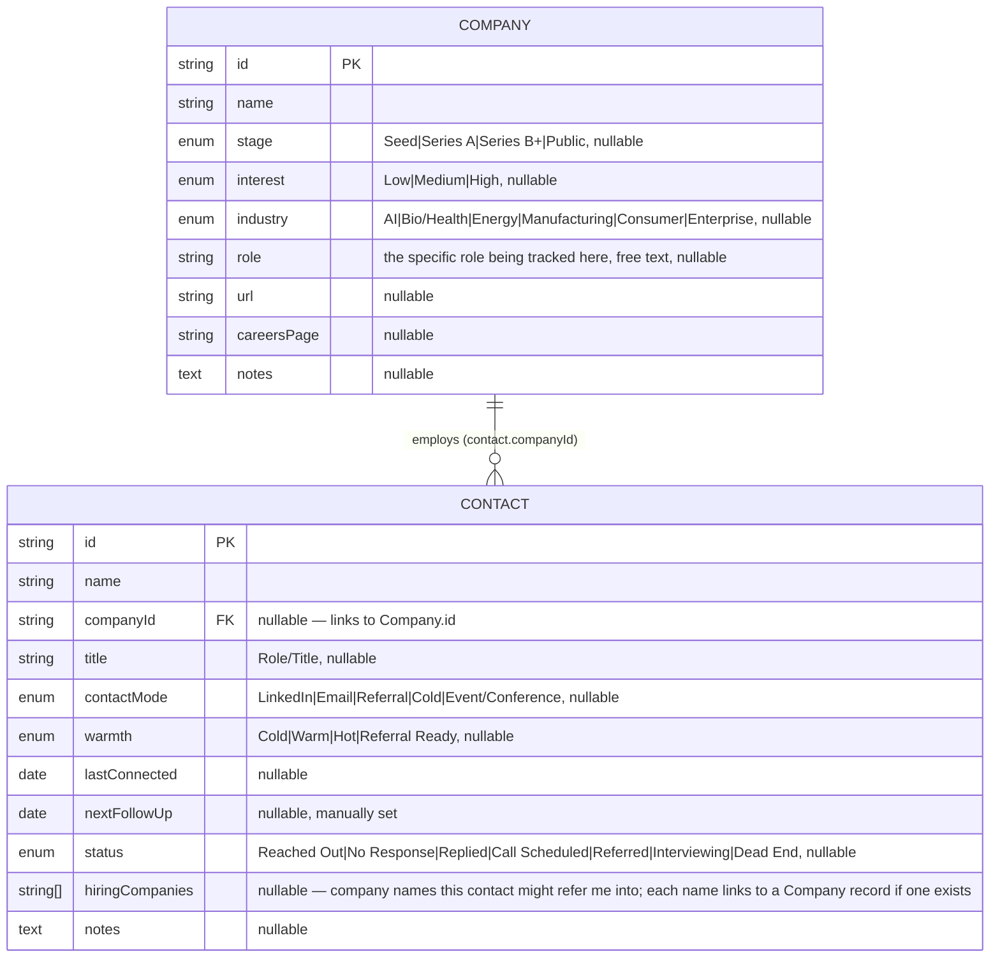

# Job Search Tracker

Status: draft
Owner: Raghav (single user)
Last updated: 2026-08-20

---

## What it is

A local, single-user tool for tracking job-search contacts and companies.

**Target architecture:** FastAPI backend + PostgreSQL database (via SQLAlchemy +
Alembic), React + Vite + TypeScript frontend. Python tooling: `uv`, `pytest`,
`ruff`, `ty`. Runs entirely locally — no LLM dependency, no external services,
deterministic.

`tracker.html` at the repo root is a working prototype (localStorage, no build
step). It defines the UX and data model but will be replaced by the full-stack
implementation.

---

## Data model

The shape of the JSON object stored under one `localStorage` key.

A contact optionally links to one company via `companyId`. A company's
Contact(s) list isn't stored — it's computed by filtering contacts for a
matching `companyId`. Deleting a company clears a linked contact's
`companyId`; it doesn't delete the contact.
