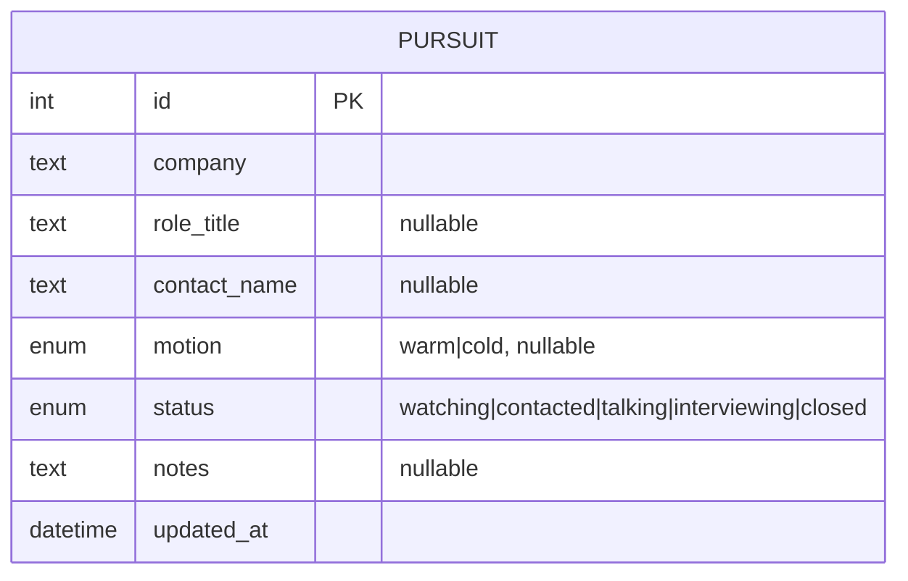

# Job Search Tracker — v1 Plan

Status: draft
Owner: Raghav (single user)
Last updated: 2026-08-20 (rev 5 — reset)

---

## 0. Why this is rev 5

Rev 4 was already an attempt to cut scope (5 tables, ~15 requirements) after
the first-draft sheets showed that unmaintained structure is worse than no
structure. It still failed the same way: the full backend, funnel, quotas,
corpus, and frontend were built end to end (see `raghav/version1` for the
complete prior implementation — companies/contacts/threads API, cadence
engine, digest, funnel, campaign targets, corpus browser, CSV import, bulk
mode) without ever checking, screen by screen, whether it would get opened
daily. It didn't get used. That branch is kept as reference, not deleted —
some of it may get rebuilt — but `main` starts clean.

**The lesson isn't "the schema was wrong." It's "nothing was validated
before more was built."** Rev 5's only structural change is a mandatory
checkpoint: a screen has to survive being used with fake data before any
backend is written for it.

---

## 1. Overview

I am actively job searching for **Forward Deployed Engineer, Software
Engineer, Machine Learning Engineer, and Member of Technical Staff** roles.
Two motions, unchanged from rev 4:

- **Bottom-up (warm).** I know a person, and reach out to explore
  opportunities at their company or tap their network.
- **Top-down (cold).** I identify a company, find the role, reach out cold.

The failure mode is losing the thread — forgetting who I owe a follow-up,
letting a warm intro go cold, having no honest read on whether I'm making
progress. A spreadsheet already exists (`docs/reference/*.csv`) and is not
being kept up — most rows are a name and nothing else.

## 2. The one thing this has to do

**Answer "what's my pipeline right now?" faster and more honestly than the
spreadsheet, in one screen: a list of pursuits (company, role, contact,
status).** No follow-up dates, no cadences, no funnel math, no quotas, no
corpus — not because those ideas are bad, but because none of them matter
if the list itself never gets opened. Everything else is deferred until
the list has earned daily use.

### Success criteria for the list alone

- I open it most days for two weeks without being reminded to.
- Adding a new pursuit or updating a status takes less time than editing
  the spreadsheet did.
- Two weeks in, `docs/reference/*.csv` is dead and I haven't reopened it.

If the list doesn't clear these, the fix is to simplify the list further —
not to add features on top of it.

---

## 3. Workflow: mockup before backend

This is the part that was skipped last time, and it is now a hard gate.

**Phase 0 — Mockup. No database, no API, no auth.**
A single page — a table: Company, Role, Contact, Status, Notes. Data lives
in a plain JSON or CSV file I hand-edit, or in the browser's localStorage —
whichever is faster to build. Seed it by hand from
`docs/reference/bottom-up.csv` and `docs/reference/top-down.csv` so it
opens with real data, not an empty table. Sorting/filtering by status is
allowed if trivial; nothing else.

Use it for real, daily, for at least a week. Update it when I actually
reach out to someone or hear back. Do not write any backend code during
this phase, even if it looks easy.

**Exit check, after a week:**
- Did I actually open and update it most days? If not, the screen is
  wrong — go back and change *what's on the screen*, not the tech under
  it, and run the check again.
- What did I reach for that wasn't there? Write it down. That list — not
  the rev-4 requirements — is the only legitimate source of new scope.

**Phase 1 — Minimal backend. Only after Phase 0 passes.**
Promote the mockup's one table to a real FastAPI + SQLite + SQLAlchemy
backend so data survives a browser refresh and isn't hand-edited JSON
anymore. Same screen, same columns. No new features get added in this
step — it's a swap of storage, not a scope increase.

**After that,** any further feature (follow-up reminders, a funnel view,
CSV import, the corpus) gets proposed, justified by something Phase 0/1
actually surfaced, and built one at a time — each one is its own small
addition, not a batch. Do not restart the rev-4 backlog wholesale.

---

## 4. Non-goals (v1 — everything not in §2 is deferred)

Same spirit as rev 4's non-goals, extended: **anything not required to
render and edit the single list is out**, including things rev 4 treated
as core:

- **No follow-up dates or cadence engine.** Status is manually updated;
  nothing computes a next-touch date. (Rev 4's FR-7/FR-8/FR-11.)
- **No digest, no "overdue/due today/at risk" logic.** That's a
  computed view on top of follow-up dates, which don't exist yet.
- **No funnel, no stage-conversion math, no daily quotas, no campaign
  targets.** All derived reporting on top of history that isn't being
  captured yet.
- **No touch/stage-event history tables.** The list holds current state
  only. If I later want "what did I do on this pursuit and when," that's
  a new table added when a real question needs it, not in advance.
- **No corpus (resume/experience/answers/stories).** Real, but a separate
  concern from "do I open this list." Its own plan when it's next.
- **No CSV import tooling.** Seeding the mockup by hand once is enough
  for a table with maybe 40 rows.
- **No auto-applying, multi-user, auth, hosting, mobile polish, Gmail or
  LinkedIn ingest, job-board scraping, LLM dependency.** All unchanged
  from rev 4 and still out of scope.

## 5. Data model (v1 — one table)

No `company` or `contact` tables — a pursuit is company/role/contact as
plain text, flat, the way the spreadsheet already is. Normalizing
companies and contacts into their own tables (so one company can have
several pursuits without repeating the name, or so a contact can be
tracked apart from any one pursuit) is exactly the kind of thing to add
**after** Phase 0/1 shows it's needed — e.g. if I keep having to retype
the same company name, or want "everyone I know at Acme" as its own view.

`status` is five values, collapsing rev 4's stage + terminal-status split
into one field: `watching`, `contacted`, `talking`, `interviewing`,
`closed`. `closed` covers rejected/ghosted/withdrawn/offer-declined alike;
the reason goes in `notes` if it matters. Splitting `closed` back out is
cheap to do later and not worth a decision now.

---

## 6. Open questions

1. Mockup storage: hand-edited JSON file vs. localStorage vs. a throwaway
   SQLite file read directly by a script. Pick whichever is fastest to
   build Phase 0 with — it gets thrown away in Phase 1 regardless.
2. What, if anything, from `raghav/version1` is worth cherry-picking once
   Phase 1 starts (e.g. the business-day helper, the CSV parsing for the
   two reference sheets) versus rewriting small. Decide per-item when it's
   actually needed, not now.

---

## 7. Out of scope for this document

Technical design — DDL, API routes, component structure — for anything
past Phase 1. Nothing beyond the single list is designed until Phase 0
proves it's wanted.
